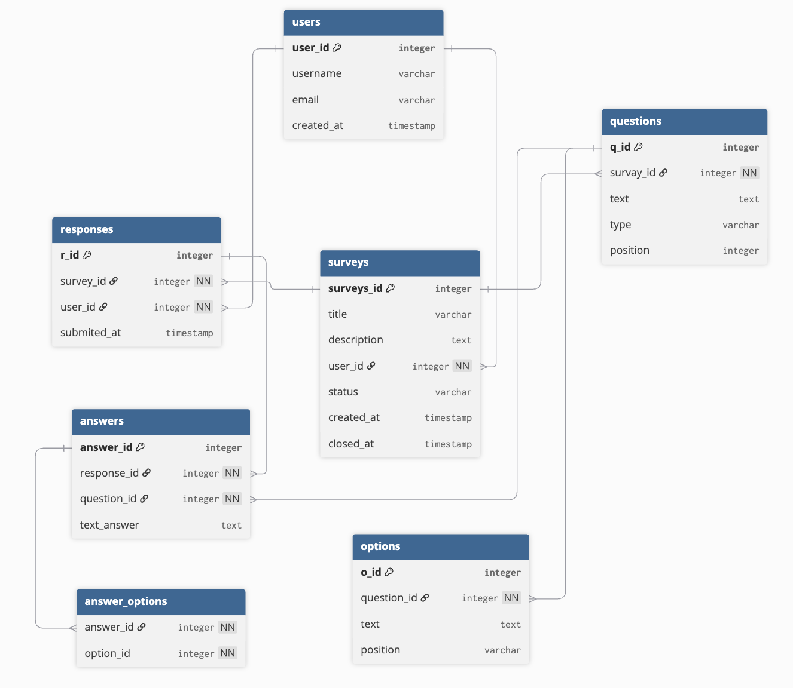

# Шубкин С.М. | 1ИСП-21 | Сервис опросов
## 1. Стек:
 - Flask
 - PostgreSQL

## 2. Изображение er-диаграммы бд проекта

## 3. Список эндпоинтов:
### Auth
	•	POST /auth/register 			- Регистрауия пользователя
	•	POST /auth/login				- Авторизация пользователя
	•	GET /auth/me					- Вывод данных текушего пользователя
### Surveys
	•	POST /surveys					- Создать новый опрос
	•	GET /surveys					- Получить список всех опросов пользователя
	•	GET /surveys/{id}				- Получить данные опроса по его id
	•	PUT /surveys/{id}				- Обновить опрос
	•	POST /surveys/{id}/publish		- Опубликовать опрос
	•	POST /surveys/{id}/close		- Закрыть опрос
	•   DELETE /surveys/{id}			- Удалить опрос
	•	POST /surveys/<id>/publish		- Опубликовать опрос
	•	POST /surveys/<id>/close		- Закрыть опрос
### Questions
	•	POST /surveys/{id}/questions	- Добавить вопрос к опросу
	•	GET /surveys/{id}/questions		- Получить данные вопроса
	•	PUT /questions/{id}				- Обновить вопрос
	•	DELETE /questions/{id}			- Удалить вопрос
### Options
	•	POST /questions/{id}/options	- Добавить вариант ответа
	•	PUT /options/{id}				- Изменить вариант овтета
	•	DELETE /options/{id}			- Удалить вариант ответа
### Responses
	•	POST /surveys/{id}/responses 		– Отправить ответы на опубликованный опрос.
	•	GET /surveys/{id}/responses/{user_id} – Получить свои ответы на опрос (для авторов или респондентов).
### Analytics
	•	GET /surveys/{id}/results		- Получить статистику опроса